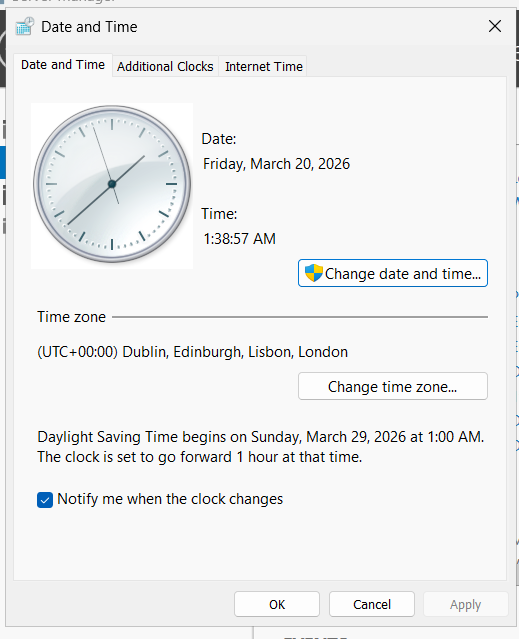
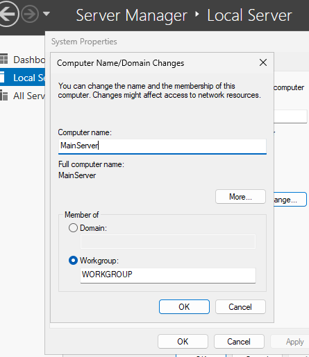
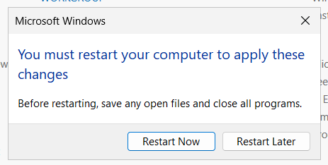
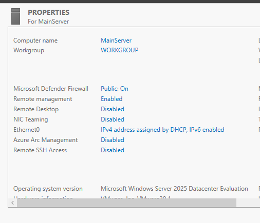

# Initial Server Configuration (Windows Server 2025)
## Overview

In this lab, I performed initial post-installation configuration on Windows Server 2025, focusing on preparing the server for network and administrative tasks.

## Objective

- Configure basic server settings after installation

- Rename the server for proper identification

- Prepare the system for further configuration

## Tasks Performed
### 1. Opening Server Manager

- Logged into the server using Administrator credentials

- Accessed Server Manager dashboard

### 2. Configuring Date and Time
- Navigated to the Local Server panel
- Changed the date and time zone

### 3. Renaming the Server

- Navigated to system settings

- Changed the default server name to: "MainServer"

- Applied changes

### 4. Restarting the Server

- Restarted the system to apply the new server name

   

### 5. Verifying Changes

- Logged back into the system

- Confirmed the new server name was successfully applied

## No major issues encountered

## Lession learned

- Importance of assigning a proper server name in a network environment

- Basic post-installation configuration steps

- How system changes require a restart to take effect

## Next Steps

- Configure static IP address

- Set up network roles (DNS, DHCP)

- Begin Active Directory setup

## Final Thoughts

- This step helped establish a properly identified server within my lab environment, which is essential for managing multiple systems in a network.
