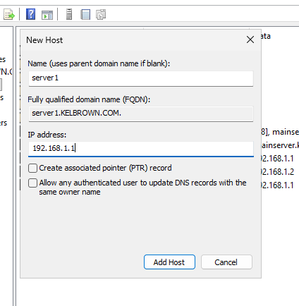
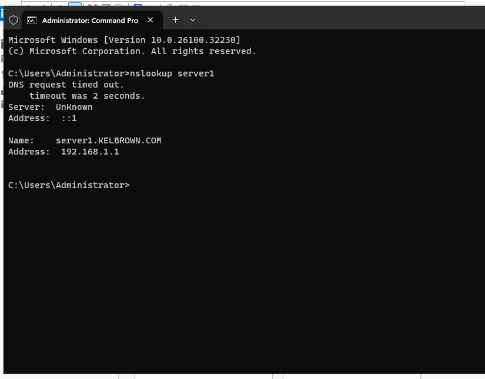

# DNS Configuration (Windows Server 2025)
## Overview

In this lab, I configured Domain Name System (DNS) on Windows Server 2025 to support name resolution within the domain environment.

## Objective
- Configure DNS for domain name resolution
- Verify DNS functionality within the network
- Ensure proper integration with Active Directory
## Configuration Steps
### 1. Verifying DNS Installation
- Opened Server Manager
- Confirmed DNS role was installed (automatically with AD DS)

### 2. Opening DNS Manager
- Navigated to Tools → DNS

### 3. Inspecting Forward Lookup Zones
- Expanded server → Forward Lookup Zones
- Verified domain zone (e.g., lab.local) exists

### 4. Creating a New Host (A Record)
- Right-clicked on the zone → New Host (A or AAAA)
- Entered:
- Name (e.g., server1)
- IP address

### 5. Testing DNS Resolution
- Opened Command Prompt
- Ran:
 nslookup server1
- Verified correct IP resolution

### 6. Testing Domain Resolution
- Pinged the domain name:
ping yourdomain.local
- Confirmed successful response

## Challenges Encountered
- (Add issues or: “No major issues encountered”)
## What I Learned
- Role of DNS in domain environments
- How name resolution works
- Importance of DNS in Active Directory functionality
## Next Steps
- Configure file sharing services
- Implement Shadow Copies
- Set up network resources
## Final Thoughts

- DNS is a core service in any network environment, enabling communication between systems through human-readable names instead of IP addresses.
