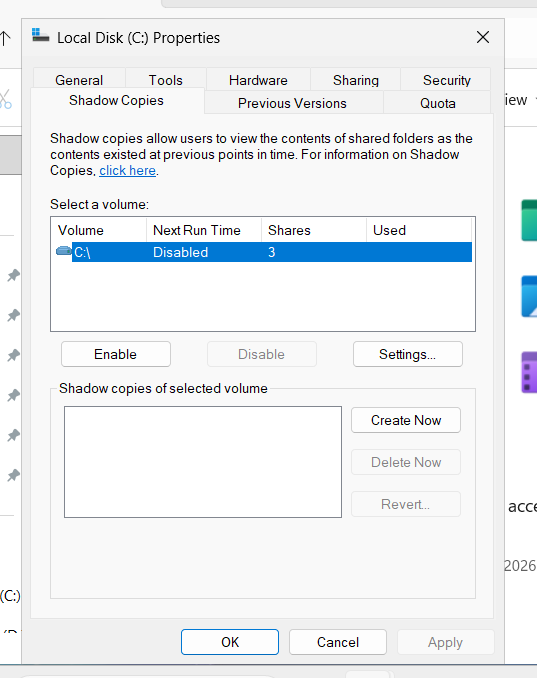
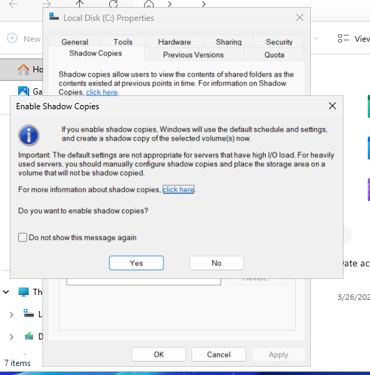
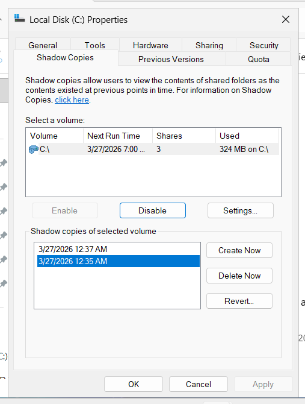
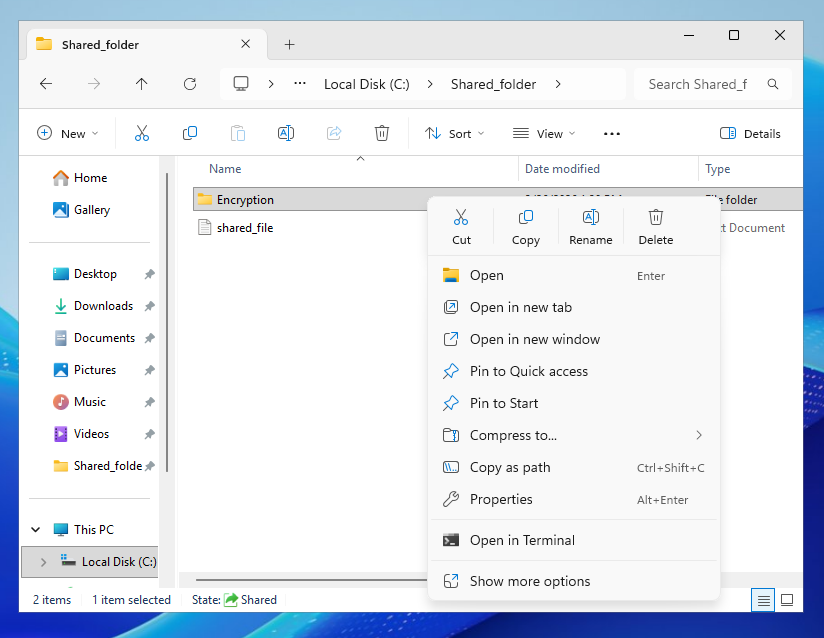
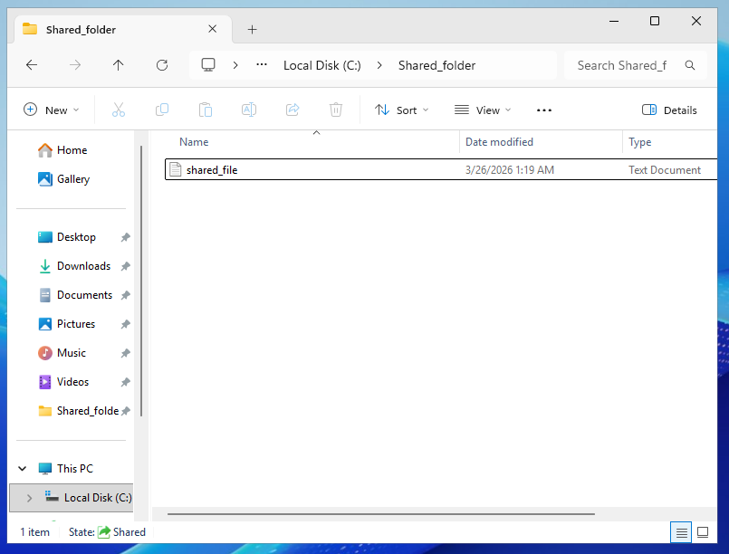
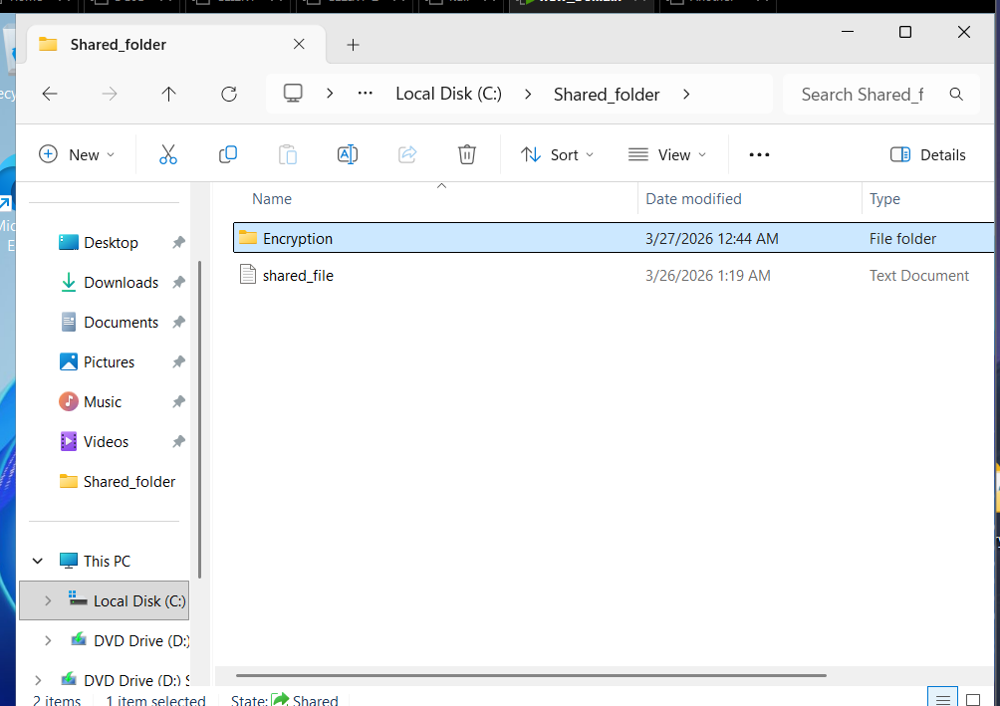

# Shadow Copies Configuration (File Recovery Setup)
## Overview

In this lab, I configured Shadow Copies on Windows Server 2025 to enable file recovery and version restoration on shared folders.

## Objective
- Enable Shadow Copies on a volume
- Create restore points
- Recover deleted or modified files
## Configuration Steps
### 1. Opening Shadow Copies Settings
- Opened File Explorer
- clicked on the drive (e.g., C: or D:)
- Selected Properties → Shadow Copies

### 2. Enabling Shadow Copies
- Selected the drive
- Clicked Enable
- Configured storage settings (optional)

### 3. Creating a Restore Point
- Clicked Create Now to manually create a snapshot

### 4. Simulating File Deletion
- Deleted or modified a file in the shared folder

- 

- 

### 5. Restoring Previous Version
- Right-clicked folder → Properties → Previous Versions
- Selected a snapshot
- Clicked Restore or Open

## Challenges Encountered
- No major issues encountered
## What I Learned
- How Shadow Copies provide backup and recovery
- Importance of data protection in network environments
- How to restore previous versions of files
## Next Steps
- Configure advanced backup solutions
- Manage storage allocation for snapshots
- Implement user-level recovery
## Final Thoughts

- Shadow Copies is a powerful feature that enhances data protection by allowing quick recovery of lost or modified files without requiring full backups.
