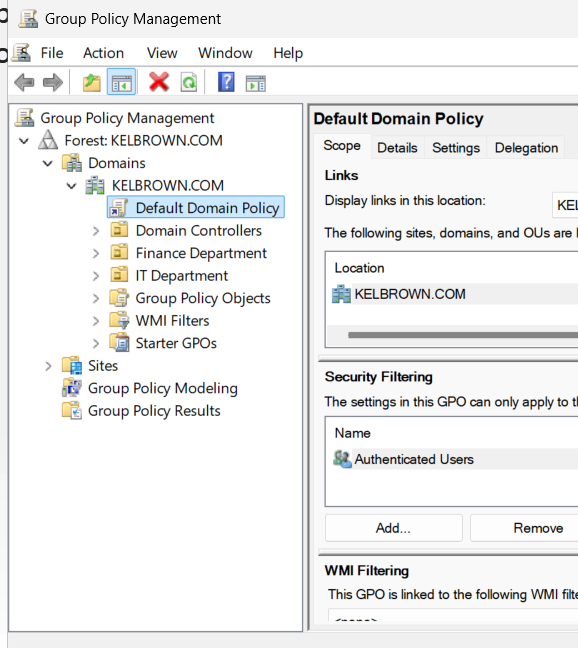
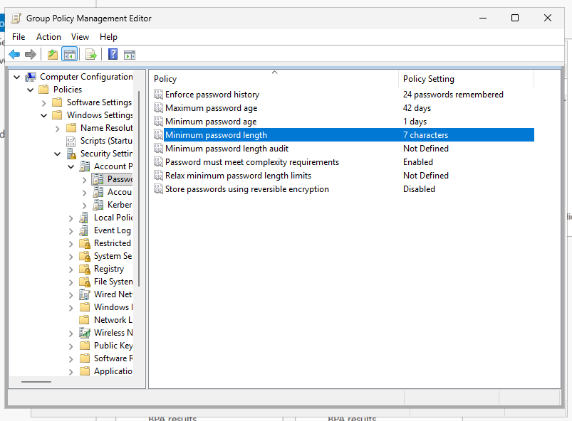
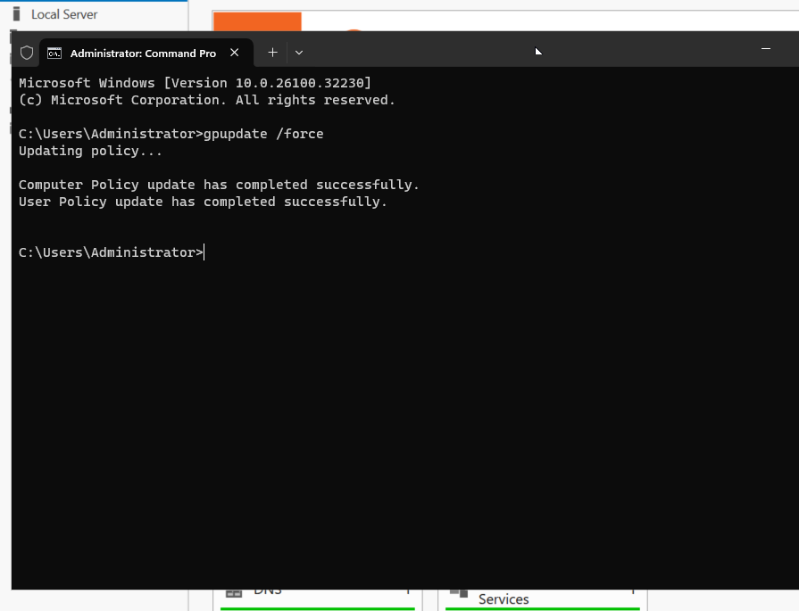

# Group Policy Configuration (Domain Control Setup)
## Overview

- In this lab, I configured Group Policy in Windows Server 2025 to enforce security and control settings across the domain.

## Objectives
- Apply domain-wide policies
- Enforce password security
- Control user environment
## Configuration Steps
### 1. Opening Group Policy Management
- Opened Server Manager
- Navigated to Tools → Group Policy Management

### 2. Editing Default Domain Policy
- Expanded domain
- Right-clicked Default Domain Policy → Edit

### 3. Configuring Password Policy
- Navigated to:
- Computer Configuration
- Policies
- Windows Settings
- Security Settings
- Account Policies
- Password Policy
- Set:
- Minimum password length
- Password complexity
- Expiration

### 4. Applying Policy
- Ran:
gpupdate /force

### 5. Verifying Policy
- Tested with a user account
- Confirmed policy enforcement

## Challenges Encountered
- No major issues encountered
## What I Learned
- How Group Policy enforces centralized control
- Importance of security policies in domain environments
- Managing user behavior across the network
## Next Steps
- Create additional GPOs
- Apply restrictions to users
- Explore advanced security policies
## Final Thoughts

- Group Policy is a powerful administrative tool that allows centralized management and enforcement of rules across a domain environment.
